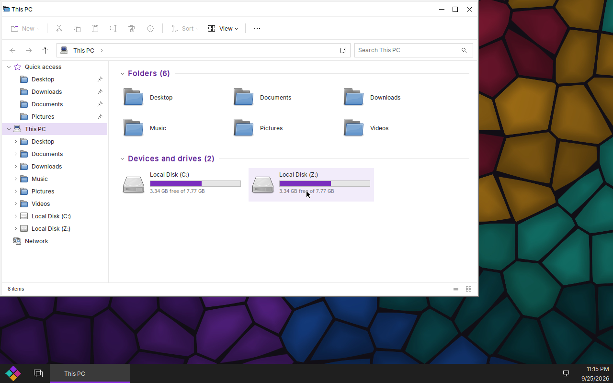
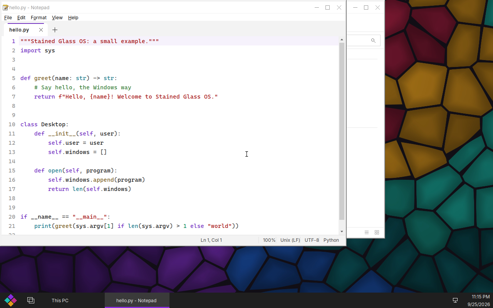

# Stained Glass OS

**A free, open-source operating system that looks and works like Windows 10 — and runs
Windows programs.**

**Website: [freesoft.page](https://freesoft.page)** — download the ISO, read the docs, set up
the package repository.

Debian underneath, [Wine](https://www.winehq.org/) with our own patch series running the whole
Windows side as one system-wide Windows personality (one machine hive, one wineserver, real
Windows-style accounts), and a shell, Control Panel, Settings and apps written from scratch to
behave like the real thing. It is built for desktops and managed fleets: it joins an Active
Directory domain (or hosts one), applies Group Policy, runs logon scripts and PowerShell, and
takes Remote Desktop connections.

**Status: in active development, not yet a daily driver.** The live ISO boots, runs and
installs (beside Windows, too); what works and what is left is tracked in
[docs/whats-left.md](docs/whats-left.md) and on the website.

## Try it

> **Stained Glass OS is not Microsoft Windows.** It is an independent open-source operating system
> designed to be compatible with Windows programs. It is not a Microsoft product and is not
> affiliated with, endorsed by, or sponsored by Microsoft Corporation. Windows is a trademark of
> Microsoft Corporation.

Download **[sg-live-latest.iso](https://freesoft.page/iso/sg-live-latest.iso)** (about 2 GB,
64-bit UEFI PCs; checksums in [/iso/](https://freesoft.page/iso/)). Write it to a USB stick or
attach it to a VM's CD drive with **UEFI firmware on** (4 GB RAM, 24 GB disk), boot
**Stained Glass OS (live: try or install)**, and choose *Try* or *Install now* in Setup.

## What's in it

- **The Windows 10 shell:** Start menu, taskbar, virtual desktops and Task View, snap,
  Win-key shortcuts, File Explorer (search, thumbnails, preview pane, progress and conflict
  dialogs), Settings (Win+I) and a full Control Panel, dark mode, a first-run setup.
- **Windows programs:** 32- and 64-bit from one amd64 install (Wine's new WoW64), .NET
  Framework, MSI/NSIS installers, winget, PowerShell 7, Python, Git for Windows, WebView2 apps,
  and Microsoft Edge when you install it yourself.
- **The apps a Windows user expects:** Notepad (a real code editor), Calculator, Paint,
  Snipping Tool, Photos, Media Player, a PDF viewer, Terminal, Task Manager, Alarms & Clock,
  Sticky Notes, Character Map, WordPad, and the admin tools — Services, Event Viewer, Device
  Manager, Disk Management, Computer Management. See [docs/default-apps.md](docs/default-apps.md).
- **Voice typing (Win+H)** with NVIDIA's open Parakeet model, installed with the system and
  running entirely offline.
- **Fleet features:** multiple users with administrators and UAC-style elevation, a real lock
  screen, AD domain join or domain controller (Samba), Group Policy, drive maps, logon scripts,
  Remote Desktop in.

## Repositories

| Repo | What it is |
|---|---|
| [`stained-glass`](https://github.com/Stained-Glass-OS/stained-glass) | This repo: the brief, roadmap, architecture decisions, docs and the website (`site/`) |
| [`wine-sg`](https://github.com/Stained-Glass-OS/wine-sg) | Wine 10.0 plus our patch series: multi-user system prefix, shell, Notepad, File Explorer, compatibility fixes |
| [`sg-shell`](https://github.com/Stained-Glass-OS/sg-shell) | Start menu, taskbar pieces, Control Panel, Settings and the apps |
| [`sg-session`](https://github.com/Stained-Glass-OS/sg-session) | Sessions, sign-in and lock screen, the installer, first-run setup, system services and helpers |
| [`sg-compositor`](https://github.com/Stained-Glass-OS/sg-compositor) | The Wayland compositor (wlroots, derived from cage) |
| [`sg-image`](https://github.com/Stained-Glass-OS/sg-image) | The image, the ISO, the apt repository publishing, and the VM test gates |

Packages: the signed apt repository at [freesoft.page/apt](https://freesoft.page/apt/).

## Docs in this repo

- [`docs/BRIEF.md`](docs/BRIEF.md) — the project brief. Read this first.
- [`ROADMAP.md`](ROADMAP.md) — phases and what "done" means for each.
- [`docs/whats-left.md`](docs/whats-left.md) — current status and open work.
- [`docs/decisions/`](docs/decisions/) — ADRs. Every non-obvious choice lands here.
- [`docs/package-repository.md`](docs/package-repository.md) — the apt repository and its key.
- [`docs/multiuser-debt.md`](docs/multiuser-debt.md) — single-user assumptions still in the code.

All of them are also on the website, at [freesoft.page/docs](https://freesoft.page/docs/index.html).

> [!IMPORTANT]
> **Wine prohibits LLM-generated code, so we do not upstream.** Wine changes stay downstream in
> `wine-sg` permanently: we own them, and every upstream release is a rebase we do ourselves.
> See [ADR 0006](docs/decisions/0006-wine-llm-contribution-policy.md).

## Ground rules

These are not negotiable; they are what keeps the project shippable.

1. **Clean room.** No leaked Microsoft source, ever. No disassembling or decompiling Microsoft
   binaries, no Microsoft artwork. Compatibility comes from re-implementing the documented APIs
   ourselves. Black-box testing against real Windows is fine.
2. **Test domains only.** Lab realm `SGTEST.LAN` and a developer Entra tenant. Never a
   production domain, tenant or real credential. Never commit secrets.
3. **Every piece has a scripted gate.** Nothing is "working" until a script says so with an
   exit code. No gate, no merge.
4. **Small, tested, one-concern patches**, so the Wine series survives rebasing.
5. **Packaging from day one.** Each repo builds a `.deb` in CI.
6. **Record decisions.** ADRs in `docs/decisions/`, with what broke and why.
7. **We never ship Microsoft's binaries.** Users install proprietary software (Edge, Office,
   winget's App Installer) themselves; we make it run.

## Non-goals

- Reimplementing the NT kernel. That is ReactOS's path, not ours.
- Windows PCIe/GPU/storage kernel drivers. Linux drivers cover that hardware.
- Running Microsoft's closed identity stack. We implement the documented interfaces instead.
- Secure Boot signing and legacy BIOS boot: UEFI is the target.

## License

**New code is AGPL-3.0-or-later.** Documentation in this repo is CC-BY-SA-4.0. **`wine-sg` is
LGPL-2.1+**, as a fork of Wine. See [ADR 0004](docs/decisions/0004-licensing.md) and
[ADR 0007](docs/decisions/0007-shell-strategy.md). Not affiliated with Microsoft; Windows is a
trademark of Microsoft Corporation.
