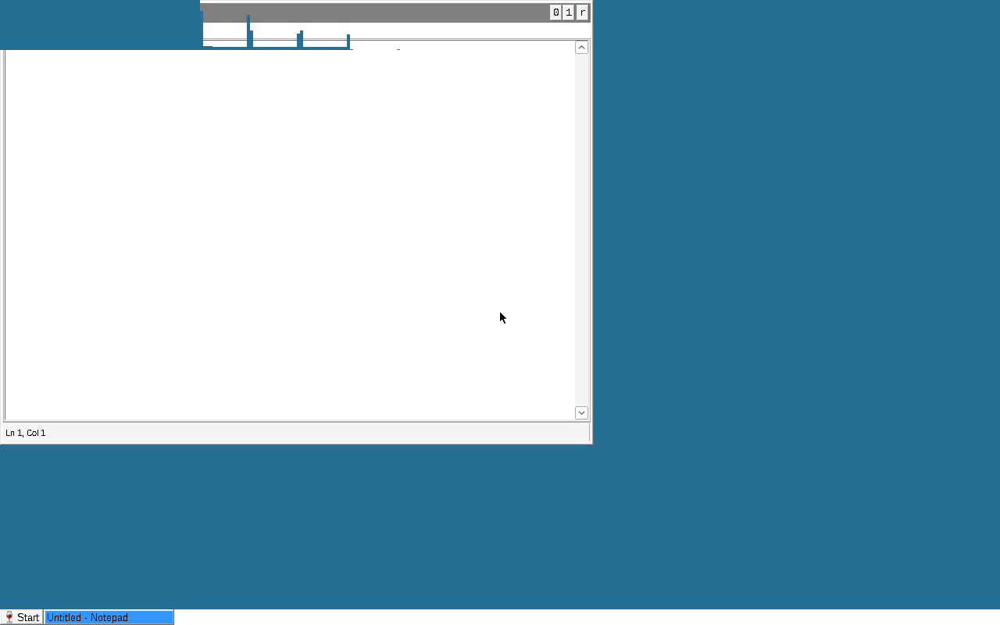

# Stained Glass OS

An open-source, drop-in Windows replacement for managed fleets.

Linux kernel and a Debian base drive the hardware. Wine runs above it as a
**system-wide Windows personality** rather than a per-user prefix: one machine
hive, one wineserver, a shell that lives inside the Wine system. The Linux side
supplies only the compositor, the greeter and the lock screen.

The goal is a machine that an existing Windows fleet can absorb without
changing how it is managed — it joins an Active Directory domain (or hosts one),
applies GPOs, runs login scripts and PowerShell, and answers the remote
management tools an admin already uses.

**Status: Phase 0 complete.** A Debian image boots in QEMU straight into Wine's
`explorer` as the shell, with a taskbar and a running Win32 app, and the boot
gate passes. Nothing here is usable as a daily driver yet — see the
[Phase 0 report](docs/phase0-report.md) for what works, what does not, and the
decisions waiting on David.

## What this repo is

The meta repo. It holds the brief, the roadmap, and the architecture decision
records. No code ships from here.

- [`docs/BRIEF.md`](docs/BRIEF.md) — the full project brief. Read this first.
- [`ROADMAP.md`](ROADMAP.md) — phases, and what "done" means for each.
- [`docs/decisions/`](docs/decisions/) — ADRs. Every non-obvious choice lands here.
- [`docs/multiuser-debt.md`](docs/multiuser-debt.md) — every place the current
  code assumes a single user. This list seeds the multi-user wineserver work.
- [`docs/phase0-report.md`](docs/phase0-report.md) — what Phase 0 found,
  including what broke on the way.
- [`docs/s2-wineserver-analysis.md`](docs/s2-wineserver-analysis.md) — whether a
  machine-level wineserver is patchable or a rewrite. **It is a patch set.**

## Repo map

Repos are created lazily, when the subproject actually starts. Empty
placeholders are noise.

| Repo | Purpose | Status |
|---|---|---|
| [`stained-glass`](https://github.com/Stained-Glass-OS/stained-glass) | Meta: brief, roadmap, ADRs, cross-repo issues | active |
| [`sg-image`](https://github.com/Stained-Glass-OS/sg-image) | mkosi config → bootable immutable Debian image; QEMU boot gate | active |
| [`sg-session`](https://github.com/Stained-Glass-OS/sg-session) | Session glue: compositor launch, system prefix init, explorer start | active |
| `sg-testlab` | Oracle harness: same test binaries on a Windows VM and on SG, diffed | Phase 1 |
| `wine-sg` | Wine fork (multi-user wineserver, NT security model) | only when a patch forces it |
| `wdf-wine` | Port of Microsoft's WDF (KMDF/UMDF) onto Wine's ntoskrnl | Phase 1 (S1) |
| `sg-pnp` | udev hotplug → INF match → auto-load into winedevice | later |
| `gpo-agent` | SYSVOL GPOs → system hive, scripts | Phase 3 |
| `prt-broker` | Entra device registration and PRT lifecycle | Phase 5 |
| `sg-shell` | The desktop shell | Phase 7 |
| `sg-compositor` | wlroots compositor with taskbar/toplevel integration | Phase 8 |
| `sg-greeter` | greetd greeter and lock screen | Phase 8 |

## Ground rules

These are not negotiable; they are what keeps the project shippable.

1. **Clean room.** No leaked Microsoft source, ever. No disassembling or
   decompiling Microsoft binaries. Black-box behavioral testing against real
   Windows is fine and encouraged. Microsoft-published open source (e.g.
   `microsoft/Windows-Driver-Frameworks`, MIT) is fine, but it stays in its own
   repo — never inside the Wine tree, so Wine patches stay upstreamable.
2. **Test domains only.** Lab realm `SGTEST.LAN` and a developer Entra tenant.
   Never a production domain, tenant or real credential. Never commit secrets.
3. **Every piece has a scripted gate.** A subproject is not "working" until
   `make test` exits 0 headlessly. No gate, no merge.
4. **Don't fork until a patch forces it.** Start on packaged upstream Wine.
   Shape every Wine patch for upstream submission: small, tested, one concern.
5. **Packaging from day one.** Each repo carries `debian/` and builds a `.deb` in CI.
6. **Record decisions.** ADRs in `docs/decisions/`. When you evaluate
   alternatives, write down what broke and why.
7. **Small PRs, conventional commits, CI green.**

## Non-goals

- Reimplementing the NT kernel. That is ReactOS's path, not ours.
- Windows PCIe/GPU/storage kernel drivers. Linux drivers cover that hardware.
- Running Microsoft's closed identity stack. We implement the documented
  interfaces instead.
- Proton. We use upstream Wine (or wine-staging) plus DXVK and VKD3D-Proton as
  separate components.

## License

**New code is AGPL-3.0-or-later.** Documentation in this repo is CC-BY-SA-4.0.
See [ADR 0004](docs/decisions/0004-licensing.md) for the full picture, including
the two places AGPL is not available to us:

- **`wine-sg` is LGPL-2.1+**, because it is a fork of Wine, and **anything
  destined for upstream Wine must be LGPL-2.1+ too.** AGPL-3.0 code cannot be
  incorporated into an LGPL-2.1+ project, so a Wine patch written in an AGPL
  repo can never be submitted. Wine-bound code is segregated by repo for this
  reason, not merely by directory.
- **`wdf-wine` is MIT**, Microsoft's license for the WDF source it ports.

`sg-shell`'s license is still open, and the P7 bake-off decides it: ReactOS is
GPL-2.0-only, which is incompatible with AGPL-3.0 in both directions.
