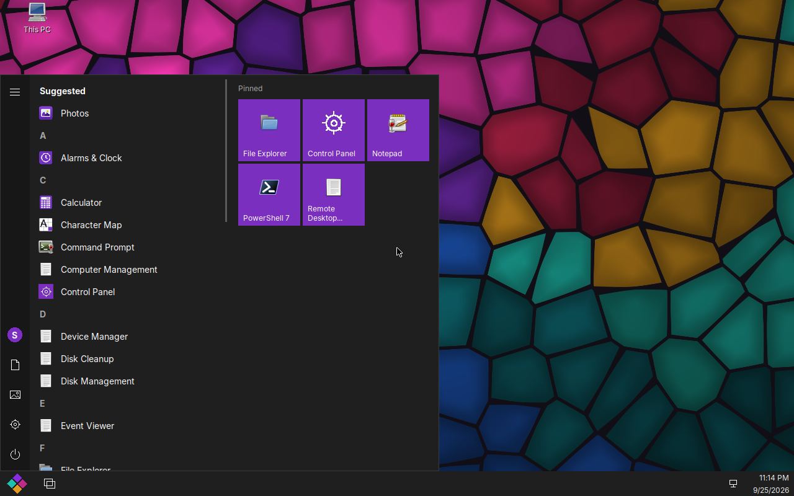
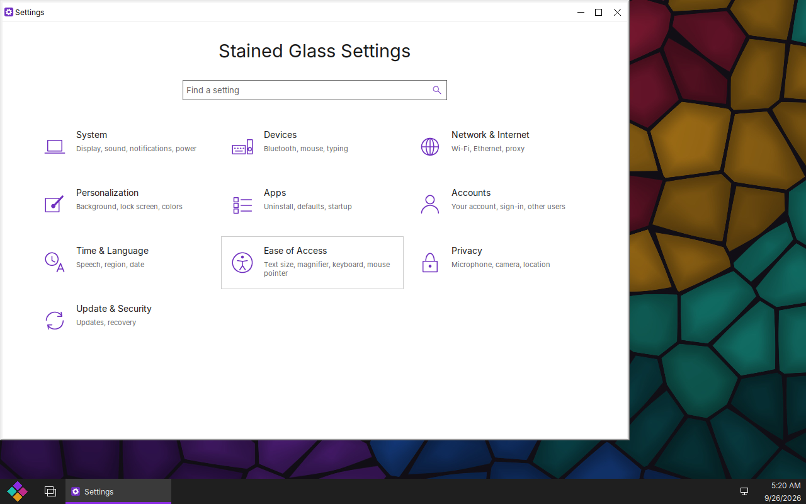
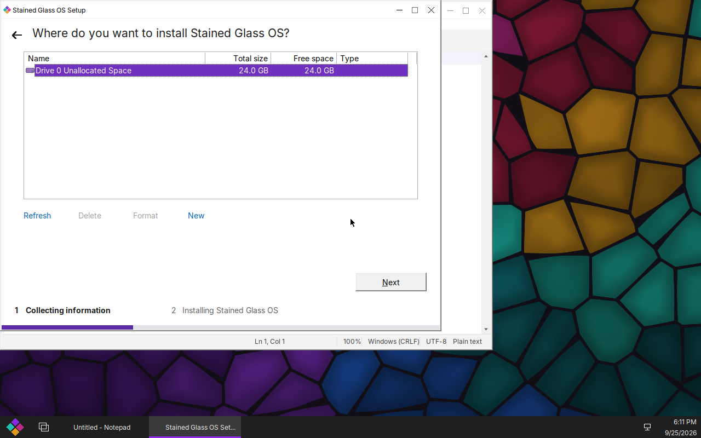

<div class="hero" markdown="1">

# Stained Glass OS

<p class="lead">A free, open-source operating system that looks and works like Windows 10 &mdash;
and runs Windows programs. Debian underneath, Wine (with our own patch series) running the whole
Windows side, and a shell, Control Panel and apps written from scratch to behave like the real thing.</p>

<div class="buttons">
<a class="btn" href="iso/sg-live-latest.iso">Download the ISO</a>
<a class="btn secondary" href="docs/index.html">Read the docs</a>
<a class="btn secondary" href="https://github.com/Stained-Glass-OS">Source on GitHub</a>
</div>

</div>

{: .shot}

## What it is

Stained Glass OS is a drop-in replacement for Windows on desktops and managed fleets: the
Start menu, taskbar, File Explorer, Control Panel and Settings a Windows user expects, running
Windows programs directly &mdash; 32- and 64-bit &mdash; with multiple users, a real lock screen,
domain join, Group Policy and Remote Desktop.

<div class="grid" markdown="1">
<div class="card" markdown="1">

### Feels like Windows 10

Start menu, taskbar, virtual desktops and Task View, snap, Win-key shortcuts, File Explorer
with search and progress dialogs, Settings (Win+I) and a full Control Panel.

</div>
<div class="card" markdown="1">

### Runs Windows programs

Our Wine build runs 32- and 64-bit programs from one install: Git for Windows, PowerShell 7,
Python, .NET Framework apps, installers (MSI, NSIS), winget, and Microsoft Edge when you
install it yourself.

</div>
<div class="card" markdown="1">

### The apps you expect

Notepad (a real code editor with tabs and highlighting), Calculator, Paint, Snipping Tool,
Photos, Media Player, Task Manager, Terminal, Alarms &amp; Clock, Sticky Notes, Character Map,
and the admin tools: Services, Event Viewer, Device Manager, Disk Management.

</div>
<div class="card" markdown="1">

### Voice typing, offline

Win+H dictates into any program, like Windows 10 &mdash; using NVIDIA's open Parakeet model,
installed with the system and running entirely on your computer. Nothing you say leaves it.

</div>
<div class="card" markdown="1">

### Built for fleets

Multiple users with Windows-style accounts and administrators, UAC-style elevation, joining an
Active Directory domain (or being its domain controller), Group Policy, drive maps and logon
scripts, and Remote Desktop in.

</div>
<div class="card" markdown="1">

### Open, top to bottom

Everything is free software (AGPL-3.0 for our code). No Microsoft code or artwork is included;
compatibility comes from re-implementing the documented Windows APIs ourselves.

</div>
</div>

<div class="grid" markdown="1">
{: .shot}
{: .shot}
{: .shot}
</div>

## Download {#download}

<div class="notice" markdown="1">

**Stained Glass OS is not Microsoft Windows.** It is an independent, free and open-source
operating system that is designed to be *compatible with* Windows programs. It is not a Microsoft
product, contains no Microsoft code, and is not affiliated with, endorsed by, or sponsored by
Microsoft Corporation in any way. Windows is a trademark of Microsoft Corporation.

</div>

**[sg-live-latest.iso](iso/sg-live-latest.iso)** &mdash; about 2 GB, for 64-bit PCs with UEFI
firmware. Older builds and SHA-256 checksums are in [/iso/](iso/).

1. Write it to a USB stick (any image writer, or `dd`), or attach it to a virtual machine's CD
   drive. In a VM, turn on **UEFI** firmware (VirtualBox: *Enable EFI*; virt-manager/QEMU: OVMF)
   and give it at least 4 GB of memory and a 24 GB disk.
2. Boot it and choose **Stained Glass OS (live: try or install)**.
3. Setup appears. Choose **Try Stained Glass OS** to use it without changing the computer, or
   **Install now** to install it: pick or create a partition (it can go beside Windows), then
   name the computer and create your account.

Nothing on the computer changes until you run Setup's install.

{: .shot}

## Package repository

Installed systems update from our signed apt repository at
[freesoft.page/apt](apt/). To add it to a Debian 13 (trixie) machine by hand:

```
curl -fsSL https://freesoft.page/apt/stained-glass-archive-keyring.gpg \
  | sudo tee /usr/share/keyrings/stained-glass-archive-keyring.gpg >/dev/null
sudo tee /etc/apt/sources.list.d/stained-glass.sources <<EOF
Types: deb
URIs: https://freesoft.page/apt
Suites: trixie
Components: main
Signed-By: /usr/share/keyrings/stained-glass-archive-keyring.gpg
EOF
sudo apt update
```

## Status

Stained Glass OS is in active development and **not yet ready for everyday use**. What works
and what is left is tracked in [What's left](docs/whats-left.html); the app inventory is in
[Default apps](docs/default-apps.html), and the design is in the
[project brief](docs/BRIEF.html) and the [architecture decisions](docs/index.html).

## Source

Every piece is on GitHub under [Stained-Glass-OS](https://github.com/Stained-Glass-OS):
`wine-sg` (Wine and our patches), `sg-shell` (Start menu, Control Panel, Settings, apps),
`sg-session` (sessions, sign-in, installer, system services), `sg-compositor` (the display
server), `sg-image` (the image, ISO and test gates) and `stained-glass` (docs and decisions).
